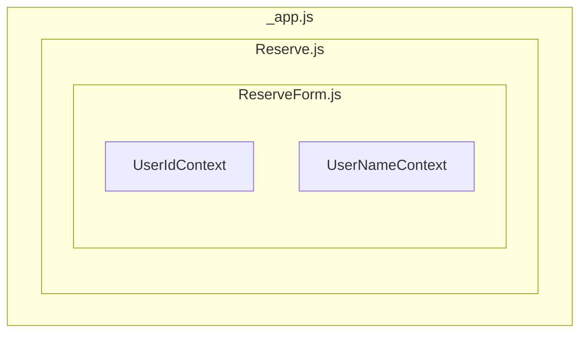

# - 프로젝트 개요
예전 PHP 프레임워크인 Laravel을 통해 개발한 회의실 예약 프로젝트의 일부 기능을 프로트 영역은 react와 react 프레임워크인 Next.js, 백엔드 영역은 Spring Boot, Spring Data JPA, Spring Security 등을 통해 구현해 보았으며 해당 문서에서는 프론트 부분에 대해 중점적으로 다루었다.


# - 개발기간
- 25.04 ~ 25.05(약 1.5개월)

# - 개발환경
- node.js v18.20.5
- react v19.0.0
- Next.js v15.2.4
- Semantic UI React, Axios, FullCalendar 등 라이브러리

# - 주요기능
- 사용자인증
기본 사용자 인증, JWT 토큰 발급, 재발급localStorage와 sessionStorage를 통한 사용자 접근 제어, react Context를 통한 값 전달 처리
- 게시판
기본 게시판 CRUD 기능 및 검색, Semantic UI를통한 페이징 처리, react reducer를 통한 검색 기능, react useRef를 이용한 렌더링 제어 및 DOM 엘리먼트 처리 등
- 코멘트
코멘트 CRUD, 코멘트 트리 UI 표현
- 예약
특정일자 시간대 예약 및 수정, 사용자 권한에 따른 예약 제한,
FullCalendar 라이브러리를 통한 달력 UI 표현, react useRef를 이용한 렌더링 제어 및 DOM 엘리먼트 처리 등

# - 특이사항
- Next.js의 Pages Router를 통해 구현 하였으며 공식 문서의 경우 App Router 사용을 권장 하나 Next.js를 처음 접할 경우 Pages Router부터 사용하는 것이 추천되는 것으로 보여 Pages Router를 통해 구현. 향후 App Router 마이그레이션 학습 필요
(참고 -  
<https://dev.to/dcs-ink/nextjs-app-router-vs-pages-router-3p57>,  <https://stackoverflow.com/questions/76570208/what-is-different-between-app-router-and-pages-router-in-next-js>,   <https://www.reddit.com/r/nextjs/comments/1gdxcg5/why_do_you_still_prefer_page_router_over_app/>)

- 기본 App 재정의 하여 _app.js를 통한 커스텀 앱 형태로 구현
(참고 - <https://www.dhiwise.com/post/the-power-of-nextjs-custom-routes-in-modern-web-development>)
- UI는 Semantic UI React 라이브러리를 사용하여 구현
- 백엔드 부분과 데이터 요청, 응답을 위해 Axios 라이브러리를 사용 

<!-- <details>
<summary>제목</summary> -->
<!-- </details> -->
## 1. 사용자인증
### 1.1 인증처리
사용자 인증 및 접근 제어는 Spring Security와 JWT 라이브러리를 통해서 구현 하였으며 로그인 성공시 localStorage, sessionStorage에 인증과 권한 확인에 필요한 값을 저장한다.


login.js
```js
await Axios.post(`${process.env.NEXT_PUBLIC_API_URL}/api/v1/user/login`, 
          {
            loginId: loginId,
            userPassword: userPassword
          },
          {
            withCredentials: true
          }
        )
        .then(function (response) {

          if (response.headers.access) {
            localStorage.setItem("access", response.headers.access);
            window.sessionStorage.setItem("loginId", loginId);
            window.sessionStorage.setItem("userName", response.headers["username"]); 
            setAccessToken(localStorage.getItem("access"));
            setLoginUserId(loginId);
            setLoginUserName(response.headers["username"]);
          }
          
          alert("Login Success");
          router.push(`/`);
        })
```

### 1.2 사용자 정보 처리
로컬과 세션 스토리지에 인증 정보와 사용자 정보를 저장 후 로그인 컴포넌트에서 _app.js로 부터 전달 받은 state setter를 통해 액세스 토큰과 유저아이디 값을 state에 저장하고 _app.js는 useEffect를 통해 state의 변경을 감지하여 컴포넌트를 재렌더링 한다

- _app.js
```js
export default function MyApp({ Component, pageProps }) {
  const [accessToken, setAccessToken] = useState();
  const [loginUserId, setLoginUserId] = useState();
  const [loginUserName, setLoginUserName] = useState("");
  const [reissueResult, setReissueResult] = useState(false);
...중략
  useEffect(() => {
    setAccessToken(localStorage.getItem("access"));
    setLoginUserId(window.sessionStorage.getItem("loginId"));
    setLoginUserName(window.sessionStorage.getItem("userName"));
  }, [accessToken, loginUserId, loginUserName, reissueResult]);
```

### 1.3 react Context를 통한 자식 컴포넌트로 값 전달
useEffect를 통한 state 변경 감지 부분 추가는 프로바이더 컴포넌트에서 변경된 state를 값을 사용하기 위함과 이후 react Context를 통한 값 전달을 구현해 보기 위해서이다.  
(<span style="color:red">**Next.js 13 이후 App Router는 Server Component Context Provider를 미지원 하므로 향후 마이그레이션 시에는 Client Component를 이용해 구성해 볼 예정**.</span> )  
참고 - <https://nextjs.org/docs/app/getting-started/server-and-client-components#context-providers>  
<https://nextjs-ko.org/docs/app/building-your-application/rendering/server-components>


- UserContext.js
```js
import { createContext } from 'react';
export const UserIdContext = createContext("userIdContext");
export const UserNameContext = createContext("userNameContext");
```

```js
  return (
    <div style={{ width: 800, margin: "0 auto" }}>
      <UserIdContext value={loginUserId}>
        <UserNameContext value={loginUserName}>
          <Top setAccessToken={setAccessToken}
          setLoginUserId={setLoginUserId} 
          setLoginUserName={setLoginUserName} 
          accessToken={accessToken}/>
          <Component {...pageProps} 
          setAccessToken={setAccessToken} 
          setLoginUserId={setLoginUserId} 
          setLoginUserName={setLoginUserName} 
          reissueAccessToken={reissueAccessToken}/>
          <Footer />
        </UserNameContext>
      </UserIdContext>
    </div>
  );
```
Context를 선언하고 _app.js에서 Context를 provider로 하위 컴포넌트로 전달하여 여러 컴포넌트나 여러 단계를 거치는 하위 컴포넌트에서 사용자 정보를 사용할 수 있도록 하였다.

- Context 사용 예시)

```js
import { UserIdContext } from './UserContext.js';
import { UserNameContext } from './UserContext.js';
... 생략
const userId = useContext(UserIdContext);
const userName = useContext(UserNameContext);
```
_app.js에서 Context를 제공하여 하위 ReserveForm 컴포넌트에서 로그인된 사용자의 아이디와 이름 정보를 제공된 Context에서 가져와 사용 할 수 있다.


### 1.4 인증토큰 재발급
로그인이 필요한 페이지에서는 사용의 인증토큰을 헤더값으로 서버에 전달하여 인증, 만료 여부를 확인 후 페이지를 보여주도록 하였다.

- 화면 페이지
```js
async function getData() {
  await Axios.get(`${process.env.NEXT_PUBLIC_API_URL}/api/v1/reserve/reserveList`, {
      headers: {
        "Content-Type": "application/json", 
        access: localStorage.getItem("access") 
        // 인증토큰 값 헤더 데이터로 전달
      },

```

- 서버의 인증 상태 확인 부분
```java
    try {
      jwtUtil.isExpired(accessToken);
    } catch (ExpiredJwtException e) {
      PrintWriter writer = response.getWriter();
      writer.print("accessToken expired");
      response.setStatus(HttpServletResponse.SC_UNAUTHORIZED);
      return;
    }catch (JwtException e) {
      PrintWriter writer = response.getWriter();
      writer.print("accessToken not valid");
      response.setStatus(HttpServletResponse.SC_BAD_REQUEST);
      return;
    }
```

- 인증토큰 만료 시 토큰 재발급 여부 확인


사용자 인증 성공 시 인증 jwt 토큰과 토큰 만료 시 재발급을 위한 refresh 토큰이 발급되며 사용자 화면에서 유요한 토큰이 요구되는 페이지를 만료된 토큰을 가지고 접근 시 Axios에서 401에러가 리턴되며 해당 코드 리턴 시 토큰 재발급 여부를 확인 후 재발급 되도록 구현 하였다.

- 사용자 페이지의 인증 만료 여부 및 재발급 여부 확인 부분
```js
async function getData() {
  await Axios.get(`${process.env.NEXT_PUBLIC_API_URL}/api/v1/reserve/reserveList`, {
      headers: {
        "Content-Type": "application/json", 
        access: localStorage.getItem("access")
        // 인증토큰 값 헤더 데이터로 전달
      },
      params: {
        reserveDate: toolBarState,
        reserveUserId: userId
      },
    }
  ).then((response) => {
    
... 중략

.catch(async function (error) {
      console.log("error : " + error);
      // 토큰을 통한 인증 실패 시 리턴 코드 확인
      if(error.response.status === 401){
        // 토큰 만료 시 서버에서 401에러를 리턴하여 재발급 여부 확인
        if(confirm("Session is expired. Do you want Reissue?"))
          {
            console.log("Reissue true")
            setTimeout(() => console.log("after"), 3000);
            const reissueResult = await reissueAccessToken();
            console.log("reserve reissueResult : " +reissueResult);
            if(reissueResult){
              alert("Reissue success")
            }else{
              alert("Reissue false");
              router.push(`/`); 
            }
            
          }
          else
          {
            console.log("Reissue false")
          }
      }
    });
```


인증 만료 여부 및 재발급 여부에 대한 확인은 여러 페이지에서 필요한 부분이며 토큰을 재발급 하는 부분은 최상위 _app.js에 구현 하였다.

- _app.js의 토큰 재발급 부분
```js
async function reissueAccessToken()
  {
    let result = "";
    await Axios.post(`${process.env.NEXT_PUBLIC_API_URL}/api/v1/user/reIssueToken` ,
      {},
      {
        withCredentials: true
      }
      )
      .then(function (response) {
        if(response.status === 200){
          localStorage.removeItem("access");
          localStorage.setItem("access", response.headers.access);
        }
        result = true;
      })
      .catch(function (error) {
            setReissueResult(false);
            result = false;
      });
      return result;
  }
```

### 1.5 사용자 권한 제어
Spring Security의 권한 제어 기능을 서버상에 구현 하였으며 해당 기능 확인을 위한 사용자 권한을 확인 후 접근을 제어하는 기능을 구현 하였으며 해당 페이지에서는 권한 체크 기능만 구현하고 간략한 사용자 관리 기능은 vue.js를 통해 구현 하였다.

- 서버의 SecurityConfig 클래스
```java
 http
            .authorizeHttpRequests((auth) -> auth
                    .requestMatchers(
                            "/api/v1/user/login"
                            ,"/api/v1/user/reIssueToken"
                            ,  "/"
                            , "/join").permitAll()
                    .requestMatchers(
                            "/api/v1/board/**"
                            , "/api/v1/board/detal/*"
                            , "/api/v1/comment/commentList"
                            , "/api/v1/user/userJoin"
                            , "/error").permitAll()
                    .requestMatchers("/api/v1/admin/*").hasAnyRole("ADMIN", "MANAGER")
                    // /api/v1/admin/로 시작되는 경로 접근은 ADMIN, MANAGER 권한이 있는 사용자만 접근 가능
                    .anyRequest().authenticated());

    http.addFilterBefore(new JWTFilter(jwtUtil), LoginFilter.class);
```

- COMMON, TEMP 권한이 있는 사용자가 권한이 없는 페이지 접근 시


- ManagerUser.js
```js
async function chkAuthor(){
      await Axios.get(`${process.env.NEXT_PUBLIC_API_URL}/api/v1/admin/manageUser` ,
      {
        headers: {
            'access' : accessToken
          }
      },
        {
        withCredentials: true
        }
      )
      .then(function (response) {
      })
      .catch(function (error) {
        if(error.response.status === 403){
                alert("you are not authorized");
                router.push(`/`); 
        }
      });
    }
    useEffect(() => {
        chkAuthor()
        // 페이지 렌더링 시 권한 확인
    }, []);
```

