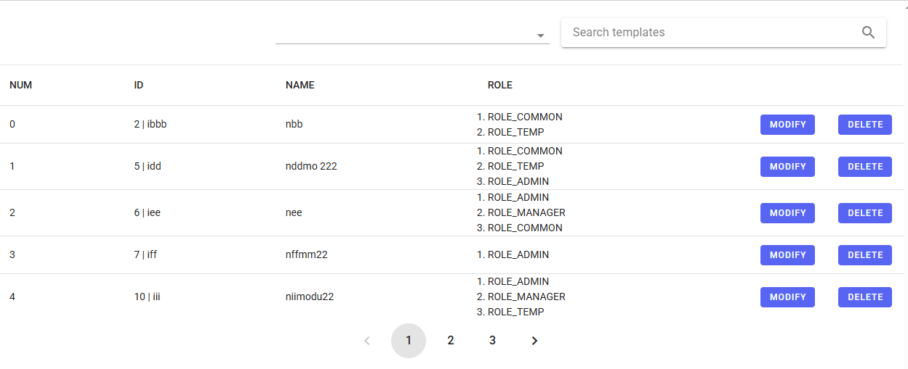

# - 프로젝트 개요
기존 React 프로젝트에 사용자 관리 메뉴를 통해 Spring Security의 사용자 Role 기능을 구현 하였고 실제 사용자를 관리하는 기능은 Vue.js를 통해 간단하게 구현해 보았다.

# - 주요 구현 기능
기능은 사용자의 리스트를 보여주는 페이지와 사용자의 정보를 변경하는 기능(사용자 이름과, Role 정보만 변경), 사용자를 삭제 하는 기능을 간단히 구현 하였다.

또한 페이지의 Vue.js를 위한 디자인 UI 프레임워크 vuetify를 사용하여 구현 하였다.
참고 - <https://vuetifyjs.com/en/>



# - 주요 특징
1. 컴포넌트간 데이터 전달을 위해 props와 vuex 라이브러리를 통한 중앙 집중식 저장소 방식 2가지를 사용 해보았다
```js
<MainComp
        :userList=userList
        :currentPage=currentPage
        :pageLength=pageLength
        @pageClick='pageClick'
        @selectFiled='selectFiled'
        @inputSearch='inputSearch'
        :searchFiled='searchFiled'
        :searchTxt='searchTxt'
        @userSearch='userSearch'
        @showModalPop='showModalPop'
      />
``` 
위 처럼 상위 컴포너트를 통해 자식 컴포넌트로 값을 전달 하고
```js
const props = defineProps(['userList', 'currentPage', 'pageLength', 'showModal'])
```
자식컴포넌트에서도 **defineProps**를 매크로를 사용하여 props를 선언하여 구현 하였으며 페이징 처리, 검색 처리 등에 props를 사용 하여 구현 하였다.

```js
   <v-pagination
        v-model="props.currentPage"
        :length="props.pageLength"
        rounded="circle"
        @update:model-value="handlePageClick"
      ></v-pagination>
```
```js
function handlePageClick(pageVal) {
  emit('mainPageClick', pageVal);
}
```
자식과 부모 사이는 하향식 단방향 바인딩 형태 이어야 하므로 클릭 이벤트 등에 대한 처리는 **emit** 이벤트를 호출 하여 구현 하였다.